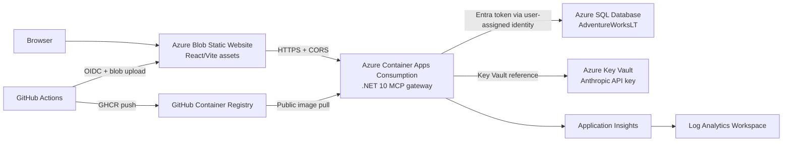
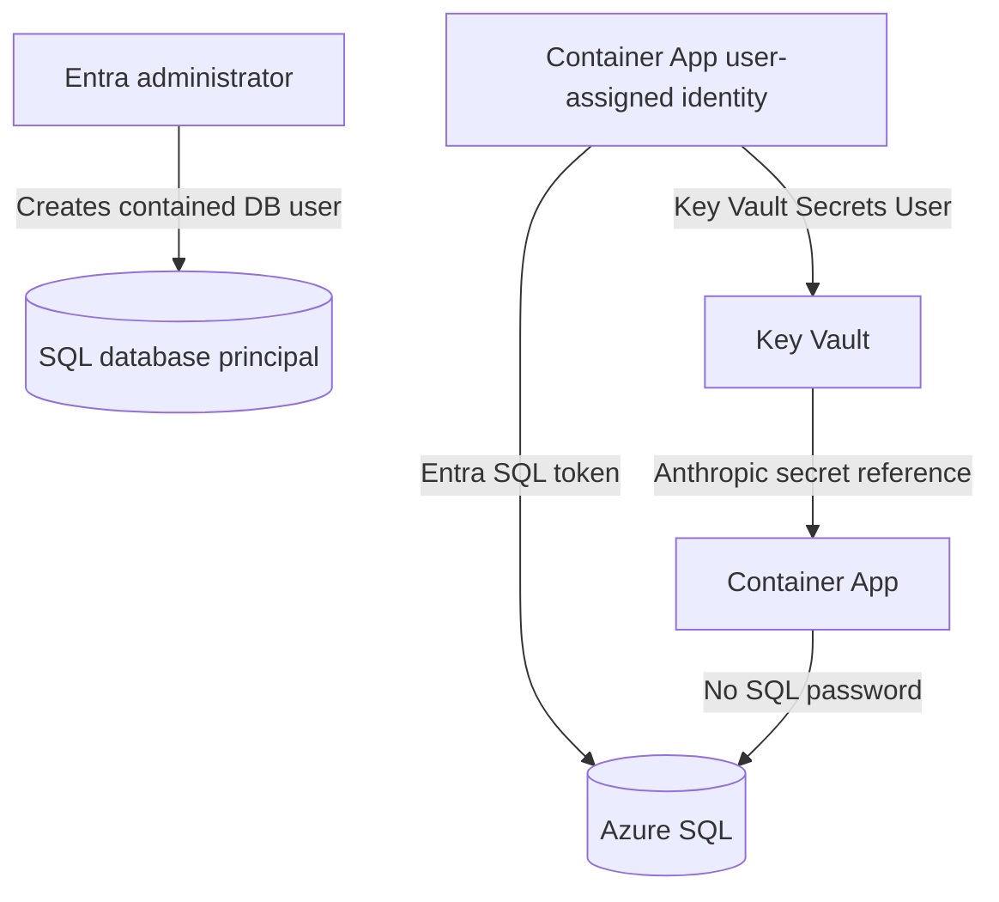
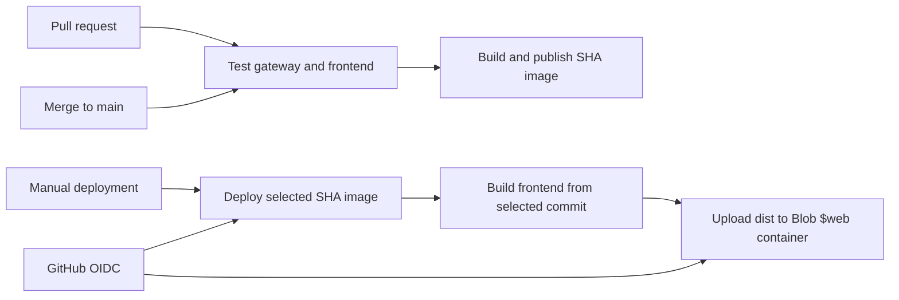

# Enterprise AI Gateway

An end-to-end portfolio sample showing a React frontend, a .NET 10 JSON-RPC MCP gateway, Azure SQL grounding, managed identity authentication, Key Vault secret references, Application Insights, GitHub Actions, GHCR, and low-cost Azure hosting.

## About This Project

This repository is a self-directed portfolio project, not client or employer work product. It exists to demonstrate hands-on ability across a full stack: cloud infrastructure as code, a governed data-access API, identity and secret management, observability, and CI/CD, wired together end to end rather than left as disconnected samples.

## Architecture

### Deployed Topology



The default deployment is intentionally public and low-cost. This repository is a public portfolio/sample deployment, not a production network design. The public posture is a deliberate trade-off to keep the system accessible from Codespaces and local VS Code while minimizing fixed networking cost. Production deployments for real data should move behind private networking, private DNS, and a WAF/API gateway.

| Layer | Azure resource | Responsibility |
| --- | --- | --- |
| Frontend | Blob Static Website | Serves the compiled Vite/React application. |
| API | Container Apps Consumption | Runs the .NET gateway with health probes and limited horizontal scaling. |
| Container image | GHCR | Stores and distributes the gateway image. |
| Data | Azure SQL serverless database | Stores and queries the AdventureWorksLT sample data. |
| Secret store | Azure Key Vault | Stores the Anthropic API key outside Terraform state. |
| Identity | User-assigned managed identity | Reads Key Vault and authenticates to SQL. |
| Observability | Application Insights + Log Analytics | Collects application, platform, and diagnostic telemetry. |
| Delivery | GitHub Actions + Azure OIDC | Tests code, publishes the image, and uploads frontend assets without long-lived Azure credentials. |

### Runtime Request Flow

The gateway provides governed, read-only database access through a JSON-RPC MCP endpoint. The chat endpoint uses Claude only after a tool result has been retrieved:

```mermaid
sequenceDiagram
	participant B as Browser
	participant F as Blob frontend
	participant G as Container App gateway
	participant I as Managed identity
	participant D as Azure SQL

	B->>F: Load index.html and assets
	B->>G: POST /api/v1/mcp initialize
	G-->>B: JSON-RPC initialize result
	B->>G: POST /api/v1/mcp tools/list
	G-->>B: Tool definitions and input schemas
	B->>G: POST /api/v1/mcp tools/call { schema, table, limit }
	G->>I: Request SQL access token
	I->>D: Authenticate as gateway identity
	G->>D: Read schema metadata or safe table rows
	D-->>G: Table metadata or rows
	G->>G: Exclude credential columns; redact and mark personal, contact, and location columns
	G-->>B: MCP text response
```

`/api/v1/mcp` returns governed SQL context through JSON-RPC tool results. `POST /api/v1/chat` uses Anthropic only after retrieving an approved MCP tool result; it never sends database entities or unapproved columns to the provider.

### Gateway Boundaries

The gateway is split into explicit ownership boundaries:

- `Core/DTOs`: MCP request, response, tool, and content contracts.
- `Data/Scaffolded`: database-first EF Core context and generated `SalesLT` entities. Regenerate generated files rather than editing them directly; the hand-authored partial model policy remains alongside the context.
- `Data/McpEntityExposure.cs` and `Data/Scaffolded/AdventureWorksDbContext.McpPolicy.cs`: EF model annotations defining safe, redacted, and excluded fields for the MCP catalog.
- `Data/Repositories`: SQL access and PII masking policy.
- `Integration/Anthropic`: typed Anthropic contracts and HTTP client.
- `Logging`: source-generated structured log messages.
- `Program.cs`: dependency injection, CORS, Serilog/Application Insights, and minimal API routes.
- `src/gateway.frontend`: browser UI and development proxy.

The repository boundary prevents database entities from leaking directly into the API. The table catalog reads the EF model's explicit exposure annotations, allows only vetted SQL metadata identifiers, and projects useful columns while marking redacted fields; endpoints return MCP DTOs rather than EF entities.

### Identity and Secret Flow



- Terraform configures the SQL Entra administrator and user-assigned gateway identity.
- The SQL bootstrap script creates `id-enterprise-ai-gateway-prod` as a contained database user and grants `db_datareader`.
- The Container App connection string uses `Authentication=Active Directory Managed Identity` and the identity client ID.
- The Anthropic key is inserted out-of-band with `bootstrap-anthropic-secret.sh`.
- The key is exposed to the container through a Key Vault reference, not a plaintext Terraform value.
- Local development uses Azure CLI/Entra authentication and environment variables or Codespaces secrets.

### Deployment Flow



Pull requests run the backend tests and frontend build gate. Merges to `main` run the same gate, collect Cobertura coverage as a workflow artifact, then publish the gateway image as `sha-<commit-sha>` to GHCR. Deployment is a separate manual workflow protected by the repository's `production` environment: an operator selects one of those immutable SHA tags, the workflow updates the Container App, builds and uploads the frontend from the same commit, then restarts the active Container App revision. Azure authentication uses a federated Entra credential, so the workflows do not require an Azure client secret.

The frontend job resolves the Container App hostname after gateway deployment and rebuilds the static assets with that URL. The hostname is stable for this Container App; an out-of-band hostname change requires a frontend redeployment.

### Operational Health and Provider Resilience

- Both health endpoints return the same fields: `status`, `liveness`, `readiness`, `database`, `anthropic`, and `details`.
- `GET /health` is a liveness endpoint: it confirms that the process can serve HTTP and reports dependency/readiness fields as `null`. It is used by the Container App liveness probe.
- `GET /health/ready` verifies database connectivity with a configurable five-second default deadline (`Health:DatabaseTimeoutSeconds`) and Key Vault-provided Anthropic key/model configuration. It returns `503` with explicit reasons when a dependency is unavailable and does not call Anthropic, avoiding probe-driven cost, quota consumption, and provider coupling.
- The Anthropic HTTP client uses configurable bounded retries (`RetryMaxAttempts`), exponential backoff with jitter (`RetryDelaySeconds`), a total timeout (`RequestTimeoutSeconds`), and circuit breaking (`CircuitBreakDurationSeconds`). The defaults are three retries, one-second initial delay, and a 30-second timeout/break duration. Rate limits, provider `5xx` responses, network failures, and timeouts are surfaced to callers as `503`; malformed provider responses, invalid requests, and invalid provider credentials return `502` without exposing provider content.

### Deployment Posture

**Implemented demo posture:** the sample uses public Container Apps ingress and permits public access to Azure SQL and Key Vault so it remains usable from Codespaces and dynamic developer IP addresses. It uses Microsoft Entra authentication for the gateway, managed identity for SQL and Key Vault, Key Vault secret references, encrypted Blob Terraform state, least-privilege database reads, and immutable SHA-tagged application revisions. The manual deployment workflow is protected by the `production` GitHub Environment when required reviewers are configured there.

**Production requirements not implemented here:** private Container Apps networking, private endpoints and DNS for SQL/Key Vault/storage, disabled public network access, WAF or API gateway protection, deployment slots or blue/green rollout, regional recovery, and a controlled deployment network. This Terraform module rejects `enable_public_network_access = false` because it does not provision the required private networking.

### Gateway API

The gateway exposes:

```text
POST /api/v1/mcp
POST /api/v1/chat
```

`POST /api/v1/mcp` accepts JSON-RPC 2.0 requests and supports `initialize`, `notifications/initialized`, `tools/list`, and `tools/call`. The endpoint is stateless: `initialize` negotiates protocol capabilities but no server-side session is created or required. The versionless `/mcp` route is retained as an alias. JSON-RPC batches are supported up to 20 requests; notifications receive no response body. The old `/mcp/tools` and `/mcp/tools/call` REST routes are removed.

The JSON-RPC envelope, batching, and tool dispatch are implemented by hand in `Program.cs` rather than through the `ModelContextProtocol.AspNetCore` SDK package. That is a deliberate choice for this portfolio piece: it demonstrates the ability to work directly with the MCP wire protocol, minimal APIs, and ASP.NET Core request pipelines rather than only wiring up a third-party SDK.

Example tool listing request:

```json
{"jsonrpc":"2.0","id":1,"method":"tools/list","params":{}}
```

`tools/list` advertises `get_customer_history`, `list_database_tables`, `read_database_table`, `get_top_selling_products_summary`, and `get_highest_revenue_products_summary`.

- The catalog tool returns every user table with its useful columns.
- The read tool requires catalog-provided schema and table names and permits 1-100 rows.
- `get_top_selling_products_summary` ranks products by total quantity sold.
- `get_highest_revenue_products_summary` ranks products by total revenue from `SalesLT.SalesOrderDetail.LineTotal` (excluding order-level tax and freight).

Both summary tools accept optional filters: `startDate`/`endDate` (`YYYY-MM-DD`, inclusive UTC calendar boundaries), `productIds` (integer array), `productCategoryIds` (integer array), and `top` (1-100, default 10). Credential and internal surrogate-key columns (e.g. password hashes, row GUIDs) are never returned; personal, contact, and location fields are returned but redacted and marked with a `[REDACTED]` value so their presence in the schema stays visible without leaking the underlying data.

Example summary request:

```json
{
  "jsonrpc": "2.0",
  "id": 2,
  "method": "tools/call",
  "params": {
    "name": "get_highest_revenue_products_summary",
    "arguments": {
      "top": 5,
      "startDate": "2024-01-01",
      "endDate": "2024-12-31",
      "productCategoryIds": [1, 2]
    }
  }
}
```

`POST /api/v1/chat` accepts `{ "message": "..." }`. When `Anthropic:ApiKey` is configured, the gateway asks Claude to select from its MCP catalog, validates that selection against the safe catalog, executes the operation, and asks Claude to answer using only that MCP result. The browser never receives the Anthropic key or direct database access. CORS is configured from `Cors:AllowedOrigins`; Terraform injects the Blob Static Website origin into the deployed gateway.

### Recruiter Sign-In

The Blob website remains public so it can be shared. The gateway requires a Microsoft Entra External ID access token in deployed environments. Recruiters can self-register using a Microsoft or work account, Google, or email one-time passcode.

Create a dedicated External ID tenant, enable those three identity providers, then create:

1. A single-page application registration with the production Blob website URL and `http://localhost:5173` as redirect URIs.
2. An API registration that exposes the `access_as_user` delegated scope.
3. SPA API permission for that scope, granting consent as required by the External ID tenant.

Set the following non-secret Terraform values before deployment:

```hcl
external_id_authority    = "https://<tenant>.ciamlogin.com/<tenant>.onmicrosoft.com"
external_id_api_audience = "<gateway-api-client-id>"
external_id_spa_client_id = "<spa-client-id>"
```

Terraform refuses to deploy the public gateway without all three values. The API then requires a bearer token containing the `access_as_user` scope. Keep `Authentication:Enabled` false only for local development.

### Regenerating The EF Model

The `Data/Scaffolded` model is generated from the `SalesLT` schema and intentionally has no embedded connection string. After installing `dotnet-ef` and authenticating to Azure SQL with Azure CLI, refresh it with:

```bash
export ADVENTURE_WORKS_CONNECTION_STRING="Server=tcp:...;Authentication=Active Directory Default;..."
./scripts/refresh-ef-model.sh
```

Keep gateway-specific extensions in separate partial classes under `Data/Scaffolded/Entities` so regeneration does not overwrite them.

## Secret Handling

Never commit API keys, passwords, `.env` files, Terraform variable files, or Terraform state. Store the Anthropic key in Key Vault for hosted deployments and use an untracked environment variable or Codespaces secret locally. Revoke and replace any key exposed in chat, a terminal transcript, or version control.

## Prerequisites

Install and authenticate:

- Azure CLI
- Terraform 1.9+
- Docker, for local image builds
- GitHub CLI, optional but useful for repository variables
- .NET 10 SDK
- Node.js 24+

Login to Azure and select the target subscription:

```bash
az login
az account set --subscription "<SUBSCRIPTION_ID>"
az account show --query '{subscription:id,tenantId:tenantId,user:user.name}' -o table
```

The signed-in Entra identity needs permission to:

- Create Azure resources in the subscription.
- Assign Azure roles.
- Set the Azure SQL Entra administrator.
- Create an Entra database user for the gateway identity.

Register resource providers if this is a new subscription:

```bash
az provider register --namespace Microsoft.App --wait
az provider register --namespace Microsoft.Storage --wait
az provider register --namespace Microsoft.Sql --wait
az provider register --namespace Microsoft.KeyVault --wait
```

## Build and Publish the Gateway Image

The GitHub Actions workflow in `.github/workflows/gateway-image.yml` builds the image from `src/gateway/Dockerfile` and publishes it to GHCR after successful tests on pushes to `main`.

For a local build using an immutable commit tag:

```bash
docker build \
	--tag ghcr.io/<GITHUB_OWNER>/<REPOSITORY>:sha-<COMMIT_SHA> \
	./src/gateway
```

For a public GHCR package, push after authenticating with a GitHub token that has package write permission:

```bash
echo "$GHCR_TOKEN" | docker login ghcr.io -u "<GITHUB_OWNER>" --password-stdin
docker push ghcr.io/<GITHUB_OWNER>/<REPOSITORY>:sha-<COMMIT_SHA>
```

The Container App can pull a public image without registry credentials. For a private GHCR package, add a Container Apps registry configuration with a read-only package token; do not put that token in committed Terraform files.

The workflow publishes immutable SHA tags for traceability. The manual deployment workflow accepts those `sha-<commit-sha>` tags and deploys the selected image after the `production` environment gate.

## Terraform Deployment

Change into the infrastructure directory:

```bash
cd infrastructure
chmod 700 bootstrap-terraform-state.sh
./bootstrap-terraform-state.sh
terraform init -upgrade -migrate-state
```

### Terraform State Backend

Terraform state is stored in a dedicated Azure Blob Storage account configured in [backend.tf](infrastructure/backend.tf). The bootstrap script creates:

- A dedicated `StorageV2` state account.
- HTTPS-only access with TLS 1.2.
- Public blob access disabled.
- Blob versioning and 30-day delete retention.
- A private `tfstate` container.
- `Storage Blob Data Contributor` for the current Entra user.

Run the bootstrap script before the first `terraform init -migrate-state`. The migration uploads the current local state to Azure and preserves resource ownership. Do not delete local state until migration completes successfully.

For another resource group, storage account, or container name, set these variables before running the script and update the matching values in `backend.tf`:

```bash
export TF_STATE_RESOURCE_GROUP="rg-enterprise-ai-portfolio-prod"
export TF_STATE_STORAGE_ACCOUNT="stentaitfstateprod"
export TF_STATE_CONTAINER="tfstate"
./bootstrap-terraform-state.sh
terraform init -upgrade -migrate-state
```

The backend uses Azure CLI/Entra authentication and native Blob state locking. Any automation identity that runs Terraform also needs `Storage Blob Data Contributor` on the state account.

Create a local untracked variables file from the example:

```bash
cp terraform.tfvars.example terraform.tfvars
```

Edit `terraform.tfvars` and set:

```hcl
subscription_id            = "<SUBSCRIPTION_ID>"
entra_admin_login_username = "<ENTRA_ADMIN_LOGIN>"
entra_admin_object_id      = "<ENTRA_ADMIN_OBJECT_ID>"
enable_public_network_access = true
external_id_authority        = "https://<tenant>.ciamlogin.com/<tenant>.onmicrosoft.com"
external_id_api_audience     = "<gateway-api-client-id>"
external_id_spa_client_id    = "<spa-client-id>"
```

Get the Entra administrator object ID with:

```bash
az ad signed-in-user show --query id -o tsv
```

Validate and plan:

```bash
terraform fmt -recursive
terraform validate
terraform plan
```

Apply:

```bash
terraform apply -lock-timeout=10m
```

If you do not use `terraform.tfvars`, pass the values explicitly:

```bash
terraform apply -lock-timeout=10m \
	-var="subscription_id=$(az account show --query id -o tsv)" \
	-var="entra_admin_login_username=<ENTRA_ADMIN_LOGIN>" \
	-var="entra_admin_object_id=$(az ad signed-in-user show --query id -o tsv)" \
	-var="enable_public_network_access=true"
```

Terraform creates:

- Resource group
- Serverless Azure SQL database seeded with AdventureWorksLT
- Entra-only SQL administrator configuration
- Key Vault with RBAC enabled
- User-assigned identity for Container Apps
- Container Apps Consumption environment and gateway
- Application Insights and Log Analytics
- Blob Static Website storage account for the frontend

Read the endpoints:

```bash
terraform output -raw gateway_app_url
terraform output -raw frontend_url
terraform output -raw sql_server_fqdn
terraform output -raw database_name
terraform output -raw key_vault_name
```

## Store the Anthropic Key in Key Vault

Terraform intentionally does not manage the Anthropic secret value. This prevents the key from being placed in Terraform configuration, command arguments, or Terraform state.

Grant your deployment identity temporary secret-management access if needed:

```bash
VAULT_ID=$(terraform output -raw key_vault_uri | sed 's:/$::')
USER_ID=$(az ad signed-in-user show --query id -o tsv)

az role assignment create \
	--assignee-object-id "$USER_ID" \
	--assignee-principal-type User \
	--role "Key Vault Secrets Officer" \
	--scope "$VAULT_ID"
```

Set the secret without printing it or committing it:

```bash
export KEY_VAULT_NAME="$(terraform output -raw key_vault_name)"
export ANTHROPIC_API_KEY="<REPLACEMENT_ANTHROPIC_KEY>"
./bootstrap-anthropic-secret.sh
unset ANTHROPIC_API_KEY
```

The Container App identity receives `Key Vault Secrets User` through Terraform. Remove your temporary `Key Vault Secrets Officer` role after bootstrapping:

```bash
az role assignment delete \
	--assignee-object-id "$USER_ID" \
	--role "Key Vault Secrets Officer" \
	--scope "$VAULT_ID"
```

## Grant the Container App SQL Read Access

The gateway uses a user-assigned managed identity and an Entra-authenticated SQL connection string. The database needs a contained Entra user for that identity.

The SQL server Entra administrator must run `bootstrap-gateway-database.sql` against the `db-adventureworks-prod` database using Entra authentication.

In Azure Portal:

1. Open the SQL database.
2. Open **Query editor**.
3. Select **Microsoft Entra authentication**.
4. Run the contents of `bootstrap-gateway-database.sql`.

Equivalent SQL:

```sql
IF NOT EXISTS (
		SELECT 1 FROM sys.database_principals
		WHERE name = N'id-enterprise-ai-gateway-prod'
)
BEGIN
		CREATE USER [id-enterprise-ai-gateway-prod] FROM EXTERNAL PROVIDER;
END;

ALTER ROLE db_datareader ADD MEMBER [id-enterprise-ai-gateway-prod];
```

The Azure SQL server may need permission to resolve service principals in Entra ID. If `CREATE USER ... FROM EXTERNAL PROVIDER` cannot find the identity, assign the SQL server identity the **Directory Readers** role and retry after propagation.

The gateway is intentionally read-only. Do not grant `db_datawriter` unless the application requirements change.

## Deploy the Frontend to Azure Blob Static Website

Terraform creates the storage account and static website endpoint. The endpoint is available as:

```bash
terraform output -raw frontend_url
```

The frontend must be built with the deployed gateway URL:

```bash
export VITE_GATEWAY_URL="$(terraform output -raw gateway_app_url)"
cd ../src/gateway.frontend
npm ci
npm run build
```

Upload the build manually with an Azure identity that has `Storage Blob Data Contributor` on the storage account:

```bash
az storage blob upload-batch \
	--account-name "$(cd ../../infrastructure && terraform output -raw frontend_storage_account_name)" \
	--destination '$web' \
	--source dist \
	--auth-mode login \
	--overwrite
```

The GitHub Actions workflow performs this upload automatically on pushes to `main` when repository variables and Azure OIDC are configured.

## GitHub Actions and Azure OIDC

The CI workflow has two jobs:

- `test`: .NET tests and frontend build.
- `image`: builds and publishes `ghcr.io/<owner>/<repository>:sha-<commit-sha>` only after the `main`-branch test job passes.

The `Deploy gateway` workflow is manual only. Its required `image_tag` input accepts the immutable `sha-<commit-sha>` image tag produced by CI. It deploys that tag, rebuilds the frontend from the tag's commit, uploads the static assets, and restarts the new active revision. Terraform is used for infrastructure provisioning only and is not run by either workflow.

Configure these repository variables:

```text
AZURE_CLIENT_ID
AZURE_TENANT_ID
AZURE_SUBSCRIPTION_ID
AZURE_RESOURCE_GROUP
GATEWAY_APP_NAME
FRONTEND_STORAGE_ACCOUNT
GATEWAY_URL
ENTRA_EXTERNAL_ID_AUTHORITY
ENTRA_EXTERNAL_ID_SPA_CLIENT_ID
ENTRA_EXTERNAL_ID_API_SCOPE
```

Create an Entra app registration/service principal and federated credential for the `main` branch. The standard GitHub subject is:

```text
repo:<GITHUB_OWNER>/<REPOSITORY>:ref:refs/heads/main
```

If GitHub presents a different owner/repository subject in the Azure login error, create the federated credential using the exact subject shown by the error.

Example GitHub CLI setup:

```bash
unset GITHUB_TOKEN
gh auth login

gh variable set AZURE_CLIENT_ID --repo <GITHUB_OWNER>/<REPOSITORY> --body "<APP_CLIENT_ID>"
gh variable set AZURE_TENANT_ID --repo <GITHUB_OWNER>/<REPOSITORY> --body "<TENANT_ID>"
gh variable set AZURE_SUBSCRIPTION_ID --repo <GITHUB_OWNER>/<REPOSITORY> --body "<SUBSCRIPTION_ID>"
gh variable set AZURE_RESOURCE_GROUP --repo <GITHUB_OWNER>/<REPOSITORY> --body "<RESOURCE_GROUP_NAME>"
gh variable set GATEWAY_APP_NAME --repo <GITHUB_OWNER>/<REPOSITORY> --body "<CONTAINER_APP_NAME>"
gh variable set FRONTEND_STORAGE_ACCOUNT --repo <GITHUB_OWNER>/<REPOSITORY> --body "<STORAGE_ACCOUNT_NAME>"
gh variable set GATEWAY_URL --repo <GITHUB_OWNER>/<REPOSITORY> --body "<GATEWAY_URL>"
```

Grant the OIDC service principal this role on the frontend storage account:

```text
Storage Blob Data Contributor
```

Do not use a client secret in the workflow. OIDC avoids storing an Azure credential in GitHub.

## Local and Codespace Development

For local development, use Azure CLI Entra authentication and the development settings already in `src/gateway/appsettings.Development.json`.

```bash
az login
az account set --subscription "<SUBSCRIPTION_ID>"

cd src/gateway
dotnet run
```

When the repository is opened in a Codespace, its `postStartCommand` updates an
Azure SQL firewall rule named after the Codespace computer name with the current
outbound IPv4 address. The signed-in identity needs permission to manage SQL firewall
rules, such as `SQL Server Contributor` on the SQL server or resource group.
The hook skips itself when Azure CLI is not logged in or the SQL server is not
deployed. Override `AZURE_RESOURCE_GROUP`, `SQL_SERVER_NAME`, or
`CODESPACE_SQL_FIREWALL_RULE_NAME` if the deployment uses different names.

Start the frontend in a second terminal:

```bash
cd src/gateway.frontend
npm ci
npm run dev
```

Open:

```text
http://localhost:5173
```

The Vite proxy sends `/api/*` to the local gateway at `http://localhost:5136`.

The local gateway needs an Anthropic key only when a code path actually calls Anthropic. Set it through an untracked environment variable or Codespaces secret:

```bash
export Anthropic__ApiKey="$ANTHROPIC_API_KEY"
```

Never put the key in `appsettings.Development.json`, `.env` files committed to Git, Terraform variables, or shell commands that will be saved in history.

## Troubleshooting

### Container App already exists

If Terraform says the Container App already exists, import it:

```bash
terraform import azurerm_container_app.gateway \
	"$(az containerapp show \
		--name "$(terraform output -raw gateway_app_name 2>/dev/null || echo aca-enterprise-ai-gateway-prod)" \
		--resource-group "$(terraform output -raw resource_group_name 2>/dev/null || echo rg-enterprise-ai-portfolio-prod)" \
		--query id -o tsv)"
```

If the existing app has `ProvisioningState: Failed`, delete only the failed Container App and rerun Terraform. Do not import an unprovisioned failed resource.

### Gateway returns HTTP 500 on customer lookup

Check Container Apps logs:

```bash
az containerapp logs show \
	--name "$(terraform output -raw gateway_app_name)" \
	--resource-group "<RESOURCE_GROUP>" \
	--tail 100 \
	--type console
```

Common causes:

- The Entra database user was not created for `id-enterprise-ai-gateway-prod`.
- The connection string is missing the user-assigned identity client ID.
- The SQL server cannot resolve the managed identity in Entra ID.
- The Key Vault secret does not exist or the Container App identity lacks `Key Vault Secrets User`.

### Frontend reports Gateway offline or Failed to fetch

Test the gateway's MCP handshake directly:

```bash
curl -i -X POST "$(terraform output -raw gateway_app_url)/api/v1/mcp" \
	-H 'Content-Type: application/json' \
	--data '{"jsonrpc":"2.0","id":1,"method":"initialize","params":{"protocolVersion":"2025-06-18","capabilities":{},"clientInfo":{"name":"curl","version":"1"}}}'
```

Check that:

- The workflow resolves the current Container App URL using `AZURE_RESOURCE_GROUP` and `GATEWAY_APP_NAME` before building the frontend.
- For local builds, `VITE_GATEWAY_URL` points to the current Container App URL.
- The gateway CORS origin matches `frontend_url`.
- The Blob Static Website contains the latest `dist` files.

### Azure login fails in GitHub Actions

Verify:

- `AZURE_CLIENT_ID`, `AZURE_TENANT_ID`, and `AZURE_SUBSCRIPTION_ID` are repository variables.
- The federated credential issuer is `https://token.actions.githubusercontent.com`.
- The federated credential subject exactly matches the GitHub assertion.
- The OIDC app has `Storage Blob Data Contributor` on the frontend storage account.
- The workflow has `id-token: write` permission.

## Tests and Builds

Run backend tests:

```bash
dotnet test src/gateway.test/gateway.test.csproj
```

Run frontend tests:

```bash
cd src/gateway.frontend
npm ci
npm test -- --run
```

Build the frontend:

```bash
cd src/gateway.frontend
npm ci
npm run build
```

Build the gateway image:

```bash
docker build --tag enterprise-ai-gateway:local ./src/gateway
```
