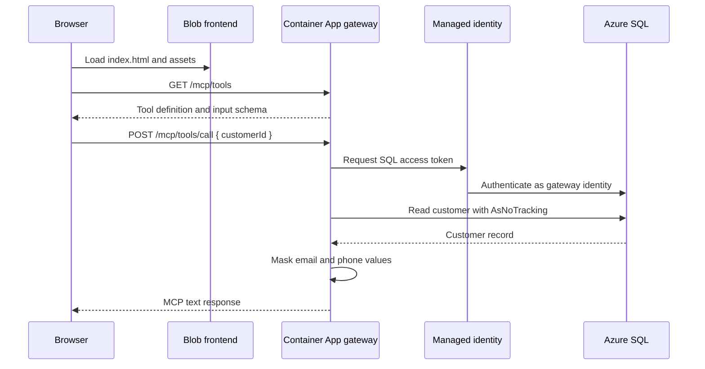
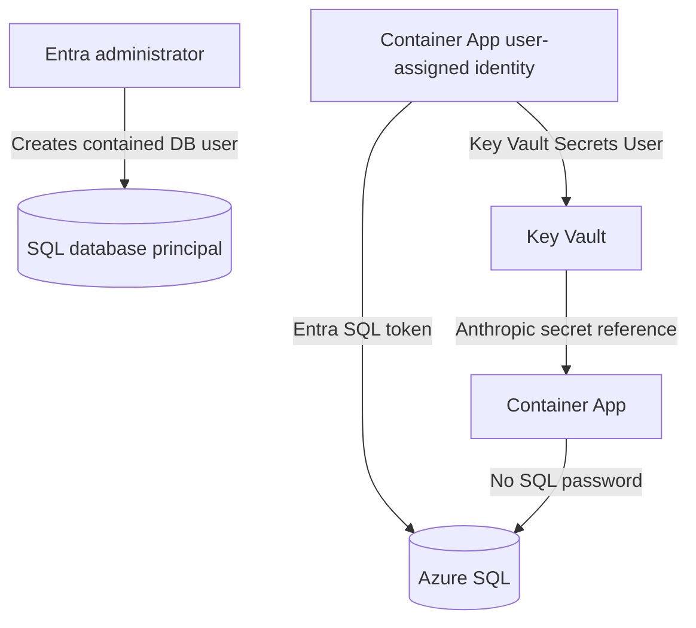
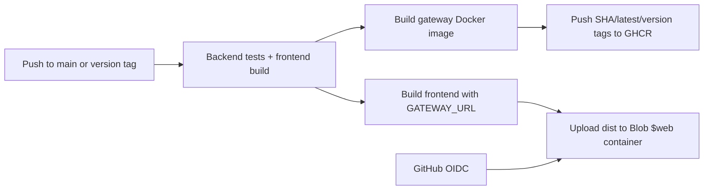

# Enterprise AI Gateway

An end-to-end portfolio sample showing a React frontend, a .NET 8 MCP gateway, Azure SQL grounding, managed identity authentication, Key Vault secret references, Application Insights, GitHub Actions, GHCR, and low-cost Azure hosting.

## Architecture

### Deployed Topology


The default deployment is intentionally public and low-cost:

| Layer | Azure resource | Responsibility |
| --- | --- | --- |
| Frontend | Blob Static Website | Serves the compiled Vite/React application. |
| API | Container Apps Consumption | Runs the .NET gateway with scale-to-zero capability. |
| Container image | GHCR | Stores and distributes the gateway image. |
| Data | Azure SQL serverless database | Stores and queries the AdventureWorksLT sample data. |
| Secret store | Azure Key Vault | Stores the Anthropic API key outside Terraform state. |
| Identity | User-assigned managed identity | Reads Key Vault and authenticates to SQL. |
| Observability | Application Insights + Log Analytics | Collects application, platform, and diagnostic telemetry. |
| Delivery | GitHub Actions + Azure OIDC | Tests code, publishes the image, and uploads frontend assets without long-lived Azure credentials. |

### Runtime Request Flow

The current customer lookup path is a governed database lookup. It does not call Claude:



The `IAnthropicClient` integration is available for LLM orchestration paths, but `/mcp/tools/call` currently returns the governed SQL context directly. A future Claude-backed endpoint should keep the same boundary: retrieve and mask data first, then pass only the approved context to Anthropic.

### Gateway Boundaries

The gateway is split into explicit ownership boundaries:

- `Core/DTOs`: MCP request, response, tool, and content contracts.
- `Data/Models`: EF Core database context and customer entity mapping.
- `Data/Repositories`: SQL access and PII masking policy.
- `Integration/Anthropic`: typed Anthropic contracts and HTTP client.
- `Logging`: source-generated structured log messages.
- `Program.cs`: dependency injection, CORS, Serilog/Application Insights, and minimal API routes.
- `src/gateway.frontend`: browser UI and development proxy.

The repository boundary prevents database entities from leaking directly into the API. The repository returns formatted, masked context; the endpoint returns MCP DTOs rather than EF entities.

### Identity and Secret Flow



- Terraform configures the SQL Entra administrator and user-assigned gateway identity.
- The SQL bootstrap script creates `id-enterprise-ai-gateway-prod` as a contained database user and grants `db_datareader`.
- The Container App connection string uses `Authentication=Active Directory Managed Identity` and the identity client ID.
- The Anthropic key is inserted out-of-band with `bootstrap-anthropic-secret.sh`.
- The key is exposed to the container through a Key Vault reference, not a plaintext Terraform value.
- Local development uses Azure CLI/Entra authentication and environment variables or Codespaces secrets.

### Deployment Flow



Pull requests run the test and build gates only. Pushes to `main` and version tags publish the gateway image and frontend. Azure authentication uses a federated Entra credential, so the workflow does not require an Azure client secret.

### Production Evolution

The public sample deliberately omits private networking to avoid fixed networking cost and to remain accessible from Codespaces. A production topology should add:

1. A VNet with dedicated subnets for Container Apps integration and private endpoints.
2. Private endpoints and private DNS zones for SQL, Key Vault, and storage.
3. Disabled public network access on SQL, Key Vault, and storage.
4. Front Door or an API gateway/WAF in front of the gateway and frontend.
5. Restricted CORS origins and ingress rules.
6. Separate subscriptions/resource groups and least-privilege deployment identities.
7. Encrypted remote Terraform state with state locking and controlled access.
8. Immutable image digests rather than the mutable `latest` tag.

### Gateway API

The gateway exposes:

```text
GET  /mcp/tools
POST /mcp/tools/call
```

`GET /mcp/tools` advertises the `get_customer_history` tool and its JSON schema. `POST /mcp/tools/call` validates the tool name and integer customer ID, forces PII masking, queries SQL, and returns an MCP response. CORS is configured from `Cors:AllowedOrigins`; Terraform injects the Blob Static Website origin into the deployed gateway.

## Important Security Note

This repository defaults to a low-cost public sample deployment so it can be demonstrated from Codespaces and local VS Code:

- Azure SQL public network access is enabled by default.
- Key Vault public network access is enabled by default.
- Container Apps has public ingress.
- Private endpoints, VNet integration, private DNS, WAF, and IP restrictions are intentionally omitted.

Do not use these defaults for real customer data. For production, set `enable_public_network_access = false` and add private networking, private DNS, restricted ingress, a WAF/API gateway, and a controlled deployment network.

Never commit API keys, passwords, `.env` files, Terraform variable files, or Terraform state. The API key previously pasted into chat or a terminal should be revoked and replaced.

## Prerequisites

Install and authenticate:

- Azure CLI
- Terraform 1.9+
- Docker, for local image builds
- GitHub CLI, optional but useful for repository variables
- .NET 8 SDK
- Node.js 22+

Login to Azure and select the target subscription:

```bash
az login
az account set --subscription "<SUBSCRIPTION_ID>"
az account show --query '{subscription:id,tenantId:tenantId,user:user.name}' -o table
```

The signed-in Entra identity needs permission to:

- Create Azure resources in the subscription.
- Assign Azure roles.
- Set the Azure SQL Entra administrator.
- Create an Entra database user for the gateway identity.

Register resource providers if this is a new subscription:

```bash
az provider register --namespace Microsoft.App --wait
az provider register --namespace Microsoft.Storage --wait
az provider register --namespace Microsoft.Sql --wait
az provider register --namespace Microsoft.KeyVault --wait
```

## Build and Publish the Gateway Image

The GitHub Actions workflow in `.github/workflows/gateway-image.yml` builds the image from `src/gateway/Dockerfile` and publishes it to GHCR on pushes to `main` and version tags.

For a local build:

```bash
docker build \
	--tag ghcr.io/<GITHUB_OWNER>/<REPOSITORY>:latest \
	./src/gateway
```

For a public GHCR package, push after authenticating with a GitHub token that has package write permission:

```bash
echo "$GHCR_TOKEN" | docker login ghcr.io -u "<GITHUB_OWNER>" --password-stdin
docker push ghcr.io/<GITHUB_OWNER>/<REPOSITORY>:latest
```

The Container App can pull a public image without registry credentials. For a private GHCR package, add a Container Apps registry configuration with a read-only package token; do not put that token in committed Terraform files.

Use an immutable SHA tag for hosted deployments when possible:

```text
ghcr.io/<GITHUB_OWNER>/<REPOSITORY>:sha-<COMMIT_SHA>
```

## Terraform Deployment

Change into the infrastructure directory:

```bash
cd infrastructure
terraform init -upgrade
```

Create a local untracked variables file from the example:

```bash
cp terraform.tfvars.example terraform.tfvars
```

Edit `terraform.tfvars` and set:

```hcl
subscription_id            = "<SUBSCRIPTION_ID>"
entra_admin_login_username = "<ENTRA_ADMIN_LOGIN>"
entra_admin_object_id      = "<ENTRA_ADMIN_OBJECT_ID>"
gateway_container_image    = "ghcr.io/<GITHUB_OWNER>/<REPOSITORY>:latest"
enable_public_network_access = true
```

Get the Entra administrator object ID with:

```bash
az ad signed-in-user show --query id -o tsv
```

Validate and plan:

```bash
terraform fmt -recursive
terraform validate
terraform plan
```

Apply:

```bash
terraform apply -lock-timeout=10m
```

If you do not use `terraform.tfvars`, pass the values explicitly:

```bash
terraform apply -lock-timeout=10m \
	-var="subscription_id=$(az account show --query id -o tsv)" \
	-var="entra_admin_login_username=<ENTRA_ADMIN_LOGIN>" \
	-var="entra_admin_object_id=$(az ad signed-in-user show --query id -o tsv)" \
	-var="gateway_container_image=ghcr.io/<GITHUB_OWNER>/<REPOSITORY>:latest" \
	-var="enable_public_network_access=true"
```

Terraform creates:

- Resource group
- Serverless Azure SQL database seeded with AdventureWorksLT
- Entra-only SQL administrator configuration
- Key Vault with RBAC enabled
- User-assigned identity for Container Apps
- Container Apps Consumption environment and gateway
- Application Insights and Log Analytics
- Blob Static Website storage account for the frontend

Read the endpoints:

```bash
terraform output -raw gateway_app_url
terraform output -raw frontend_url
terraform output -raw sql_server_fqdn
terraform output -raw database_name
terraform output -raw key_vault_name
```

## Store the Anthropic Key in Key Vault

Terraform intentionally does not manage the Anthropic secret value. This prevents the key from being placed in Terraform configuration, command arguments, or Terraform state.

Grant your deployment identity temporary secret-management access if needed:

```bash
VAULT_ID=$(terraform output -raw key_vault_uri | sed 's:/$::')
USER_ID=$(az ad signed-in-user show --query id -o tsv)

az role assignment create \
	--assignee-object-id "$USER_ID" \
	--assignee-principal-type User \
	--role "Key Vault Secrets Officer" \
	--scope "$VAULT_ID"
```

Set the secret without printing it or committing it:

```bash
export KEY_VAULT_NAME="$(terraform output -raw key_vault_name)"
export ANTHROPIC_API_KEY="<REPLACEMENT_ANTHROPIC_KEY>"
./bootstrap-anthropic-secret.sh
unset ANTHROPIC_API_KEY
```

The Container App identity receives `Key Vault Secrets User` through Terraform. Remove your temporary `Key Vault Secrets Officer` role after bootstrapping:

```bash
az role assignment delete \
	--assignee-object-id "$USER_ID" \
	--role "Key Vault Secrets Officer" \
	--scope "$VAULT_ID"
```

## Grant the Container App SQL Read Access

The gateway uses a user-assigned managed identity and an Entra-authenticated SQL connection string. The database needs a contained Entra user for that identity.

The SQL server Entra administrator must run `bootstrap-gateway-database.sql` against the `db-adventureworks-prod` database using Entra authentication.

In Azure Portal:

1. Open the SQL database.
2. Open **Query editor**.
3. Select **Microsoft Entra authentication**.
4. Run the contents of `bootstrap-gateway-database.sql`.

Equivalent SQL:

```sql
IF NOT EXISTS (
		SELECT 1 FROM sys.database_principals
		WHERE name = N'id-enterprise-ai-gateway-prod'
)
BEGIN
		CREATE USER [id-enterprise-ai-gateway-prod] FROM EXTERNAL PROVIDER;
END;

ALTER ROLE db_datareader ADD MEMBER [id-enterprise-ai-gateway-prod];
```

The Azure SQL server may need permission to resolve service principals in Entra ID. If `CREATE USER ... FROM EXTERNAL PROVIDER` cannot find the identity, assign the SQL server identity the **Directory Readers** role and retry after propagation.

The gateway is intentionally read-only. Do not grant `db_datawriter` unless the application requirements change.

## Deploy the Frontend to Azure Blob Static Website

Terraform creates the storage account and static website endpoint. The endpoint is available as:

```bash
terraform output -raw frontend_url
```

The frontend must be built with the deployed gateway URL:

```bash
export VITE_GATEWAY_URL="$(terraform output -raw gateway_app_url)"
cd ../src/gateway.frontend
npm ci
npm run build
```

Upload the build manually with an Azure identity that has `Storage Blob Data Contributor` on the storage account:

```bash
az storage blob upload-batch \
	--account-name "$(cd ../../infrastructure && terraform output -raw frontend_storage_account_name)" \
	--destination '$web' \
	--source dist \
	--auth-mode login \
	--overwrite
```

The GitHub Actions workflow performs this upload automatically on pushes to `main` when repository variables and Azure OIDC are configured.

## GitHub Actions and Azure OIDC

The workflow has three jobs:

- `test`: .NET tests and frontend build.
- `image`: GHCR image build and push.
- `frontend`: Blob Static Website build and upload.

Configure these repository variables:

```text
AZURE_CLIENT_ID
AZURE_TENANT_ID
AZURE_SUBSCRIPTION_ID
FRONTEND_STORAGE_ACCOUNT
GATEWAY_URL
```

Create an Entra app registration/service principal and federated credential for the `main` branch. The standard GitHub subject is:

```text
repo:<GITHUB_OWNER>/<REPOSITORY>:ref:refs/heads/main
```

If GitHub presents a different owner/repository subject in the Azure login error, create the federated credential using the exact subject shown by the error.

Example GitHub CLI setup:

```bash
unset GITHUB_TOKEN
gh auth login

gh variable set AZURE_CLIENT_ID --repo <GITHUB_OWNER>/<REPOSITORY> --body "<APP_CLIENT_ID>"
gh variable set AZURE_TENANT_ID --repo <GITHUB_OWNER>/<REPOSITORY> --body "<TENANT_ID>"
gh variable set AZURE_SUBSCRIPTION_ID --repo <GITHUB_OWNER>/<REPOSITORY> --body "<SUBSCRIPTION_ID>"
gh variable set FRONTEND_STORAGE_ACCOUNT --repo <GITHUB_OWNER>/<REPOSITORY> --body "<STORAGE_ACCOUNT_NAME>"
gh variable set GATEWAY_URL --repo <GITHUB_OWNER>/<REPOSITORY> --body "<GATEWAY_URL>"
```

Grant the OIDC service principal this role on the frontend storage account:

```text
Storage Blob Data Contributor
```

Do not use a client secret in the workflow. OIDC avoids storing an Azure credential in GitHub.

## Local and Codespace Development

For local development, use Azure CLI Entra authentication and the development settings already in `src/gateway/appsettings.Development.json`.

```bash
az login
az account set --subscription "<SUBSCRIPTION_ID>"

cd src/gateway
dotnet run
```

When the repository is opened in a Codespace, its `postStartCommand` updates an
Azure SQL firewall rule named after the Codespace computer name with the current
outbound IPv4 address. The signed-in identity needs permission to manage SQL firewall
rules, such as `SQL Server Contributor` on the SQL server or resource group.
The hook skips itself when Azure CLI is not logged in or the SQL server is not
deployed. Override `AZURE_RESOURCE_GROUP`, `SQL_SERVER_NAME`, or
`CODESPACE_SQL_FIREWALL_RULE_NAME` if the deployment uses different names.

Start the frontend in a second terminal:

```bash
cd src/gateway.frontend
npm ci
npm run dev
```

Open:

```text
http://localhost:5173
```

The Vite proxy sends `/api/*` to the local gateway at `http://localhost:5136`.

The local gateway needs an Anthropic key only when a code path actually calls Anthropic. Set it through an untracked environment variable or Codespaces secret:

```bash
export Anthropic__ApiKey="$ANTHROPIC_API_KEY"
```

Never put the key in `appsettings.Development.json`, `.env` files committed to Git, Terraform variables, or shell commands that will be saved in history.

## Troubleshooting

### Container App already exists

If Terraform says the Container App already exists, import it:

```bash
terraform import azurerm_container_app.gateway \
	"$(az containerapp show \
		--name "$(terraform output -raw gateway_app_name 2>/dev/null || echo aca-enterprise-ai-gateway-prod)" \
		--resource-group "$(terraform output -raw resource_group_name 2>/dev/null || echo rg-enterprise-ai-portfolio-prod)" \
		--query id -o tsv)"
```

If the existing app has `ProvisioningState: Failed`, delete only the failed Container App and rerun Terraform. Do not import an unprovisioned failed resource.

### Gateway returns HTTP 500 on customer lookup

Check Container Apps logs:

```bash
az containerapp logs show \
	--name "$(terraform output -raw gateway_app_name)" \
	--resource-group "<RESOURCE_GROUP>" \
	--tail 100 \
	--type console
```

Common causes:

- The Entra database user was not created for `id-enterprise-ai-gateway-prod`.
- The connection string is missing the user-assigned identity client ID.
- The SQL server cannot resolve the managed identity in Entra ID.
- The Key Vault secret does not exist or the Container App identity lacks `Key Vault Secrets User`.

### Frontend reports Gateway offline or Failed to fetch

Test the gateway directly:

```bash
curl -i "$(terraform output -raw gateway_app_url)/mcp/tools"
```

Check that:

- `GATEWAY_URL` points to the current Container App URL.
- The frontend was rebuilt after changing `GATEWAY_URL`.
- The gateway CORS origin matches `frontend_url`.
- The Blob Static Website contains the latest `dist` files.

### Azure login fails in GitHub Actions

Verify:

- `AZURE_CLIENT_ID`, `AZURE_TENANT_ID`, and `AZURE_SUBSCRIPTION_ID` are repository variables.
- The federated credential issuer is `https://token.actions.githubusercontent.com`.
- The federated credential subject exactly matches the GitHub assertion.
- The OIDC app has `Storage Blob Data Contributor` on the frontend storage account.
- The workflow has `id-token: write` permission.

## Tests and Builds

Run backend tests:

```bash
dotnet test src/gateway.test/gateway.test.csproj
```

Build the frontend:

```bash
cd src/gateway.frontend
npm ci
npm run build
```

Build the gateway image:

```bash
docker build --tag enterprise-ai-gateway:local ./src/gateway
```
# adventure-works-mcp-server

# Shortcomings
## Unauthenticated endpoints
This is a demonstration project.  Authentiocation is currently excluded to simplify acces for recruiters who want to view the system.

## Public Network Access to Keyvault and the database
To permit this to run in a _Github Codespace_ and locally through a dynamic address home ISP IP address restrictions are currently disabled. 

A future enhancelent would be to ad autonmatic agents to open pinholes for clients running this gateway with a suitabel authentication context.

## Anthropic integration is nit showcased.

## Frontend deployment can drift from the backend
The frontend bakes GATEWAY_URL at build time:

gateway-image.yml:58-62
gateway-image.yml:135-139
If the Container App hostname changes, the frontend can continue calling the old endpoint.

Fix: Make Terraform or a release workflow update the frontend variable automatically, and deploy backend/frontend as one versioned release.

# No security controls on web FE
This is by design on this low-cost showcase